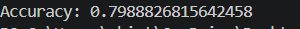

# 🛳️ Titanic Survival Prediction

## 🌟 CodSoft Data Science Internship – Task 1

## 📌 Project Overview

This project is a Titanic Survival Prediction system developed using Python and Machine Learning. It predicts whether a passenger survived the Titanic disaster based on features such as age, gender, passenger class, fare, and other details.

## 🎯 Objective

To build a machine learning classification model that predicts passenger survival on the Titanic dataset.

## 🛠 Tools Used

- Python 🐍
- Pandas
- Scikit-learn
- VS Code

## ✨ Features

### Load Titanic Dataset
### Handle Missing Values
### Convert Categorical Data into Numerical Form
### Train Machine Learning Model
### Predict Passenger Survival
### Calculate Model Accuracy

## 📚 Concepts Used

### Data Cleaning
### Data Preprocessing
### Classification
### Logistic Regression
### Accuracy Evaluation

## 📸 Output

## 📊 Result

### Model Accuracy: 79.89%

## 🎯 Conclusion

This project demonstrates how Machine Learning can be used to predict passenger survival based on historical Titanic data.

## 👩‍💻 Author

Chinta Ramalakshmi