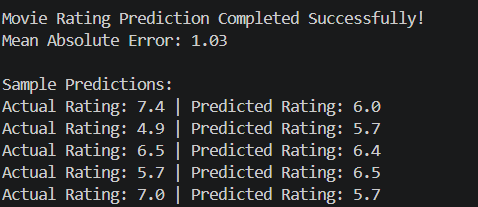

# 🎬 Movie Rating Prediction with Python

## 🌟 CodSoft Data Science Internship – Task 2

## 📌 Project Overview

This project is a Movie Rating Prediction system developed using Python and Machine Learning. It predicts movie ratings based on features such as Genre, Director, Actor 1, Actor 2, and Actor 3.

## 🎯 Objective

To build a Machine Learning regression model that predicts movie ratings using movie-related information.

## 🛠 Tools Used

- Python 🐍
- Pandas
- Scikit-learn
- VS Code

## ✨ Features

### Load Movie Dataset
### Data Cleaning and Preprocessing
### Convert Categorical Data into Numerical Form
### Train Machine Learning Model
### Predict Movie Ratings
### Calculate Model Performance

## 📚 Concepts Used

### Data Cleaning
### Label Encoding
### Machine Learning
### Regression
### Random Forest Regressor
### Mean Absolute Error (MAE)

## 📸 Output

## 📊 Result

### Mean Absolute Error (MAE): 1.03

### Sample Predictions

- Actual Rating: 7.4 | Predicted Rating: 6.0
- Actual Rating: 4.9 | Predicted Rating: 5.7
- Actual Rating: 6.5 | Predicted Rating: 6.4
- Actual Rating: 5.7 | Predicted Rating: 6.5
- Actual Rating: 7.0 | Predicted Rating: 5.7

## 🎯 Conclusion

This project demonstrates how Machine Learning can be used to predict movie ratings using movie metadata such as genre, director, and actors. The Random Forest Regressor model was used to perform rating prediction successfully.

## 👩‍💻 Author

Chinta Ramalakshmi