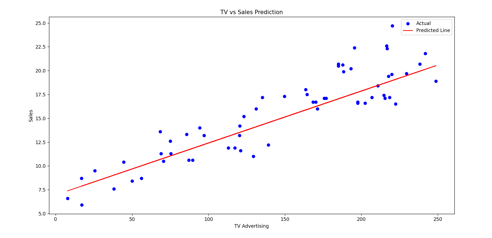
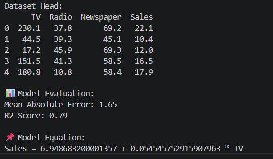

# 📈 Sales Prediction using Simple Linear Regression

## 🌟 CodSoft Data Science Internship – Task 4

---

## 📌 Objective 🎯
The objective of this project is to predict product sales based on TV advertising budget using Simple Linear Regression.

---

## 📁 Dataset Description
The dataset contains advertising data with the following features:

- TV Advertising Budget 📺  
- Radio Advertising Budget 📻  
- Newspaper Advertising Budget 📰  
- Sales (Target Variable) 💰  

---

## 🛠 Tools Used
- Python 🐍  
- Pandas  
- NumPy  
- Matplotlib 📊  
- Scikit-learn 🤖  
- VS Code 💻  

---

## 📊 Model Used
- Simple Linear Regression (Ordinary Least Squares - OLS)

---

## 📈 Model Performance
- Mean Absolute Error (MAE): **1.65**  
- R² Score: **0.79**  

---

## 📌 Model Equation
Sales = 6.94 + 0.0545 × TV

---

## 🎯 Sample Output
- Actual vs Predicted Sales comparison  
- Regression line graph 📉  

---

## 📊 Key Features
- Data visualization 📊  
- Train-test split  
- Model training 🤖  
- Prediction  
- Performance evaluation  

---

## 🧠 Conclusion
The model shows a strong positive relationship between TV advertising and sales. It predicts sales effectively with good accuracy (79% R² score).

---

## 📸 Output Files
### 📈 Regression Graph

### 🖥️ Model Output

---

## 👩‍💻 Author
Chintha Ramalakshmi