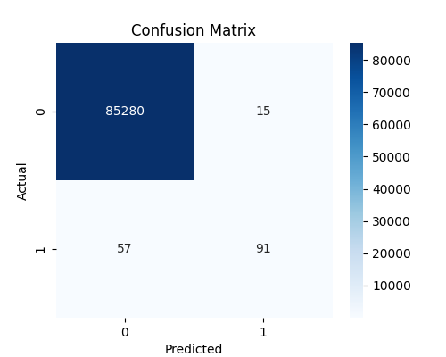
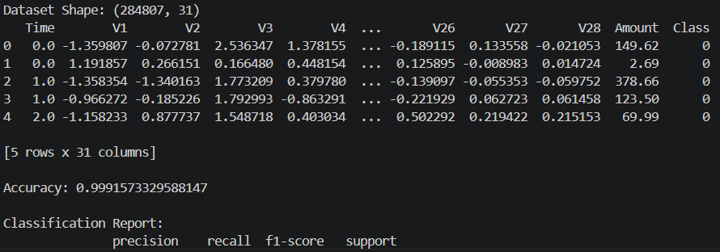

# 💳 Credit Card Fraud Detection using Machine Learning

## 🌟 CodSoft Data Science Internship – Task 5

---

## 📌 Objective 🎯
The objective of this project is to build a machine learning model that detects fraudulent credit card transactions using classification algorithms.

The model classifies transactions as:
- Normal (0)
- Fraud (1)

---

## 📁 Dataset Description

Dataset is not included in this repository due to its large size.

Please download the Credit Card Fraud Detection dataset from Kaggle:
🔗 Dataset Source:
https://www.kaggle.com/datasets/mlg-ulb/creditcardfraud
After downloading, place creditcard.csv in the project folder and run the script.

The dataset contains credit card transaction data with the following features:

- Time ⏱️  
- V1 to V28 (PCA transformed features)  
- Amount 💰  
- Class (Target Variable: 0 = Normal, 1 = Fraud)

---

## 🛠 Tools Used
- Python 🐍  
- Pandas  
- NumPy  
- Matplotlib 📊  
- Seaborn  
- Scikit-learn 🤖  
- VS Code 💻  

---

## 📊 Model Used
- Logistic Regression (Classification Model)

---

## 📈 Model Performance
- Accuracy: **99.91%**  
- Precision (Fraud): **0.86**  
- Recall (Fraud): **0.61**  
- F1-score (Fraud): **0.72**

---

## 📌 Key Results
- High accuracy achieved due to effective model training  
- Fraud detection recall shows real-world challenge due to imbalanced data  
- Model successfully identifies majority of fraudulent transactions  

---

## 🎯 Sample Output
- Dataset loading and preprocessing  
- Classification report  
- Confusion matrix visualization  

---

## 📊 Key Features
- Data preprocessing  
- Feature scaling  
- Train-test split  
- Logistic regression model  
- Evaluation metrics  
- Confusion matrix plot  

---

## 🧠 Conclusion
The model successfully detects fraudulent transactions with high accuracy. However, due to class imbalance, recall can be improved using advanced techniques like SMOTE or ensemble models.

---

## 📸 Output Files
### 📊 Confusion Matrix

### 🖥️ Model Output

---

## 👩‍💻 Author
Chintha Ramalakshmi
CodSoft Data Science Intern
